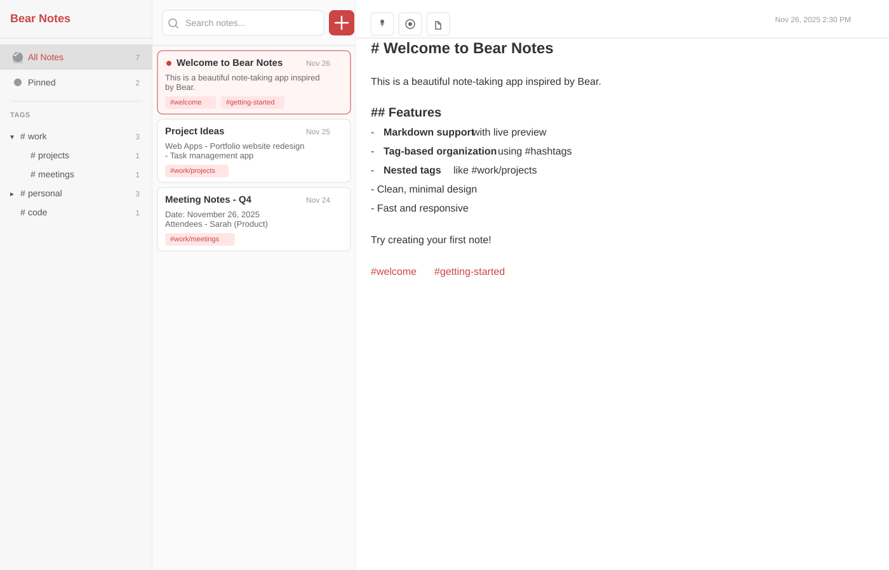
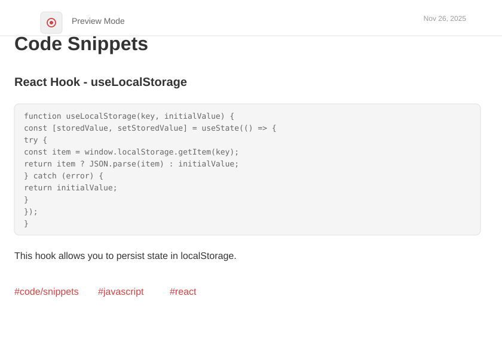
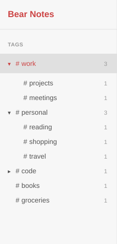

# Bear Notes

A beautiful, minimalist note-taking application inspired by Bear, built with Electron, React, and TypeScript. Features markdown support, tag-based organization, and a clean three-pane interface.


## Screenshots

### Main Interface

*Three-pane layout with tags sidebar, notes list, and markdown editor*

### Markdown Preview

*Beautiful markdown rendering with code syntax highlighting*

### Tag Hierarchy

*Nested tag support for powerful organization*

## Features

### Beautiful Clean Design
- **Three-Pane Layout**: Tags sidebar, notes list, and editor
- **Bear-Inspired UI**: Minimalist design with red accent colors
- **Clean Typography**: Professional fonts and spacing
- **Responsive Interface**: Smooth transitions and interactions

### Powerful Note-Taking
- **Markdown Support**: Full markdown editing with live preview
- **Tag-Based Organization**: Use #tags anywhere in your notes
- **Nested Tags**: Create hierarchies with #work/projects
- **Auto-Tag Extraction**: Tags are automatically detected from content
- **Pin Important Notes**: Keep frequently used notes at the top
- **Fast Search**: Instantly find notes by title or content

### Tag Hierarchy
- **Automatic Organization**: Tags with slashes create hierarchies
- **Expandable Tree View**: Navigate nested tags easily
- **Tag Counts**: See how many notes use each tag
- **Click to Filter**: View all notes with a specific tag

### Markdown Editor
- **Live Preview**: Toggle between edit and preview modes
- **Clean Interface**: Distraction-free writing experience
- **Code Blocks**: Syntax highlighting support
- **Lists and Formatting**: Full markdown feature set
- **Auto-Save**: Notes save automatically as you type

### Smart Features
- **Keyboard Shortcuts**:
  - `Cmd/Ctrl + N` - Create new note
  - `Cmd/Ctrl + F` - Focus search
- **Pin Notes**: Mark important notes to keep them at the top
- **Note Metadata**: Automatic creation and update timestamps
- **Sample Notes**: Pre-loaded examples to get you started

## Installation

### Prerequisites
- Node.js 18+ and npm

### Quick Start

1. **Download the project:**
   ```bash
   git clone <repository-url>
   cd bear-notes
   ```

2. **Install dependencies:**
   ```bash
   npm install
   ```

3. **Run in development mode:**
   ```bash
   npm run dev
   ```

## Building for Production

### Build for all platforms:
```bash
npm run build
npm run package
```

### Platform-specific builds:

**macOS:**
```bash
npm run package:mac
```

**Windows:**
```bash
npm run package:win
```

**Linux:**
```bash
npm run package:linux
```

The built applications will be available in the `release/` directory.

## Usage

### Creating Your First Note

1. **Create a New Note:**
   - Click the red "+" button in the notes list
   - Or press `Cmd/Ctrl + N`

2. **Start Writing:**
   - The first line becomes your note title
   - Use markdown for formatting
   - Add #tags anywhere in your note

3. **Example Note:**
   ```markdown
   # My First Note

   This is a **bold** statement and this is *italic*.

   ## Features I Love
   - Markdown support
   - Tag organization
   - Clean design

   #personal #notes #getting-started
   ```

### Organizing with Tags

1. **Adding Tags:**
   - Simply type `#tagname` anywhere in your note
   - Tags are automatically extracted and shown in the sidebar

2. **Creating Nested Tags:**
   - Use slashes: `#work/projects` or `#personal/reading`
   - The sidebar shows these as expandable hierarchies

3. **Filtering by Tags:**
   - Click any tag in the sidebar to filter notes
   - Click again to show all notes

### Working with Notes

1. **Edit Mode:**
   - Default view for writing
   - Plain text with markdown syntax
   - Auto-saves as you type

2. **Preview Mode:**
   - Click the eye icon to preview
   - See your markdown rendered beautifully
   - Click edit icon to return

3. **Pin Notes:**
   - Click the pin icon to pin important notes
   - Pinned notes appear at the top of the list
   - Perfect for quick reference notes

4. **Search Notes:**
   - Use the search bar to find notes
   - Searches both titles and content
   - Results update as you type

### Keyboard Shortcuts

- `Cmd/Ctrl + N` - Create new note
- `Cmd/Ctrl + F` - Focus search bar
- Click editor to start typing

## Architecture

### Technology Stack

- **Frontend**: React 18 with TypeScript
- **Desktop Framework**: Electron 28
- **Build Tool**: Vite 5
- **UI Components**: Lucide React Icons
- **Database**: SQLite (better-sqlite3)
- **Markdown**: Marked library for rendering

### Project Structure

```
bear-notes/
├── src/
│   ├── main/                 # Electron main process
│   │   ├── main.ts          # Main entry point
│   │   ├── preload.ts       # Preload script for IPC
│   │   └── services/        # Backend services
│   │       └── DatabaseService.ts
│   └── renderer/            # React application
│       ├── App.tsx          # Main app component
│       ├── main.tsx         # React entry point
│       └── index.html       # HTML template
├── package.json
├── tsconfig.json
└── vite.config.ts
```

### Database Schema

Notes are stored in a local SQLite database with the following structure:

- **id**: Unique identifier
- **title**: Note title (auto-extracted from first line)
- **content**: Full markdown content
- **tags**: JSON array of tags
- **isPinned**: Boolean for pinned status
- **isArchived**: Boolean for archived status
- **isTrashed**: Boolean for trash status
- **createdAt**: ISO timestamp
- **updatedAt**: ISO timestamp

## Sample Notes

The app comes with 7 sample notes to help you get started:

1. **Welcome to Bear Notes** - Introduction and features
2. **Project Ideas** - Example of nested tags
3. **Meeting Notes** - Template for meetings
4. **Reading List** - Book tracking example
5. **Grocery List** - Simple list example
6. **Code Snippets** - Code blocks example
7. **Travel Plans** - Detailed planning example

## Tips & Best Practices

### Tagging Strategy

- Use broad tags like `#work`, `#personal`, `#ideas`
- Create specific subtags like `#work/meetings`, `#work/projects`
- Don't overuse tags - 2-5 tags per note is usually enough
- Be consistent with tag names

### Note Organization

- Pin your most-used reference notes
- Use the first line as a clear, descriptive title
- Keep individual notes focused on one topic
- Use markdown headers for structure

### Markdown Tips

```markdown
# Heading 1
## Heading 2
### Heading 3

**Bold text**
*Italic text*
`Code inline`

- Bullet list
- Another item

1. Numbered list
2. Another item

> Quote block

[Link text](https://example.com)
```

## Troubleshooting

### Application Won't Start

1. **"npm install" fails**:
   - Check Node.js version (requires 18+)
   - Delete `node_modules` folder and run `npm install` again
   - Check internet connection

2. **Database errors**:
   - The database is created automatically on first run
   - Located in your user data directory
   - Delete database file to reset (you'll lose notes)

### Notes Not Saving

1. Check file permissions in user data directory
2. Restart the application
3. Check console for error messages

### Search Not Working

1. Ensure you're typing in the search box
2. Search is case-insensitive
3. Try searching for partial words

## Contributing

Contributions are welcome! Please follow these steps:

1. Fork the repository
2. Create a feature branch (`git checkout -b feature/amazing-feature`)
3. Commit your changes (`git commit -m 'Add amazing feature'`)
4. Push to the branch (`git push origin feature/amazing-feature`)
5. Open a Pull Request

## License

This project is licensed under the MIT License - see the [LICENSE](LICENSE) file for details.

## Acknowledgments

- [Bear](https://bear.app/) - Inspiration for design and functionality
- [Electron](https://www.electronjs.org/) - Desktop application framework
- [React](https://reactjs.org/) - UI library
- [Marked](https://marked.js.org/) - Markdown parser
- [Lucide](https://lucide.dev/) - Beautiful icon library
- [Better SQLite3](https://github.com/WiseLibs/better-sqlite3) - SQLite bindings

## Roadmap

Future features planned:

- Export notes to PDF, HTML, or plain text
- Import notes from other apps
- Dark mode theme
- Note templates
- Advanced search with filters
- Note linking
- Attachments and images
- Cloud sync (optional)
- Mobile companion app

## Support

For issues, questions, or suggestions:
- Open an issue on GitHub
- Check the [Troubleshooting](#troubleshooting) section
- Review the sample notes for examples

---

**Built with Electron, React, and TypeScript**

Enjoy beautiful, organized note-taking!
