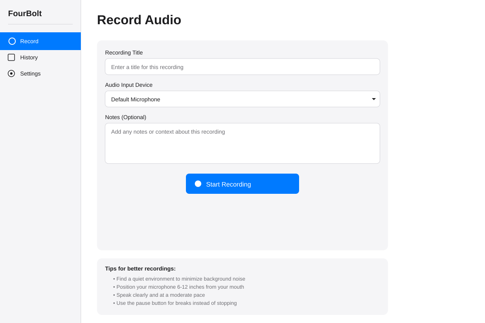
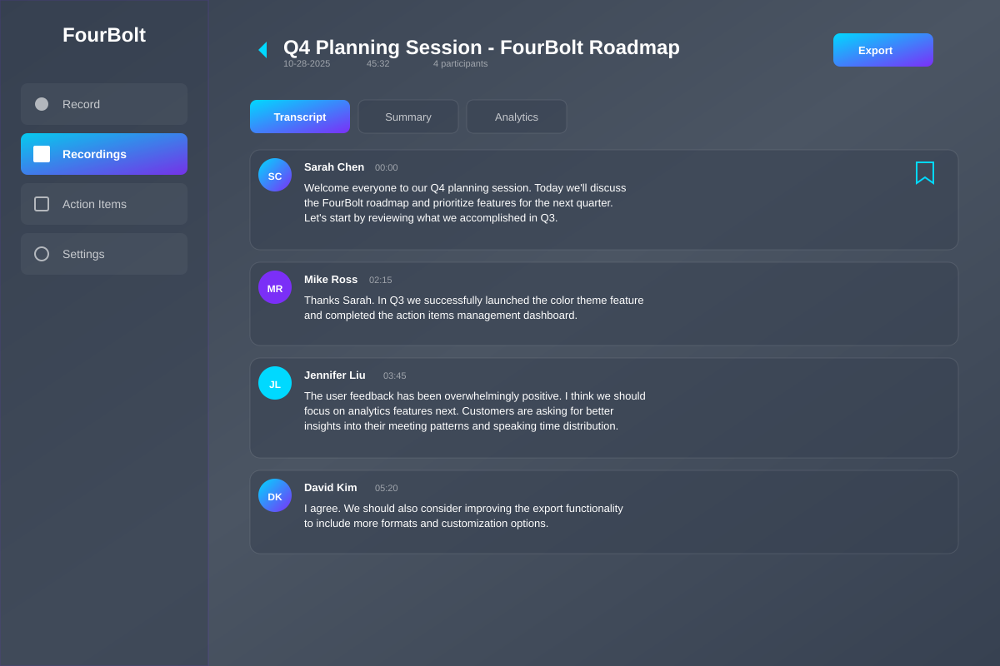
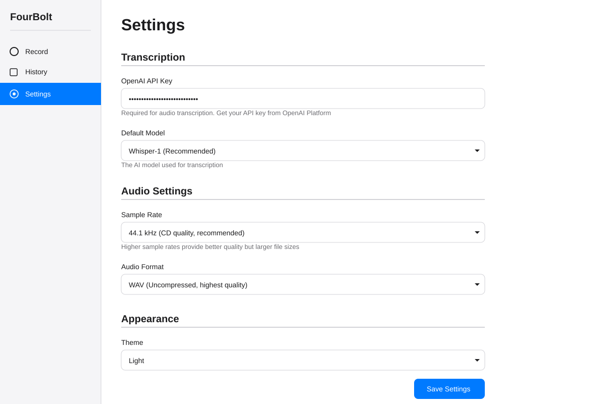

# FourBolt

A powerful cross-platform desktop application for meeting transcription, recording management, and AI-powered insights, built with Electron, React, and advanced AI models.


## Screenshots

### Recording View


*Live recording interface with audio waveform visualization, rich text notes, and real-time transcription*

### Meeting Detail View


*Comprehensive meeting view with transcript, AI summary, analytics, and action items*

### Action Items Dashboard


*Centralized action items management with assignees, priorities, and due dates*

### Settings View


*Customizable settings with multiple color themes, AI model selection, and statistics*

## Features

### Beautiful UI with Multiple Themes
- **4 Professional Color Palettes**: Medium Gray (default), Light, Midnight Blue, and Retro 90s
- **Modern Design**: Gradient-based interface with glass-morphism effects
- **Professional Icons**: Clean, consistent iconography throughout
- **Responsive Layout**: Smooth transitions and adaptive components

### Advanced Recording
- **Live Audio Waveform Visualization**: Real-time visual feedback during recording
- **Pause/Resume Capability**: Full control over recording sessions
- **Meeting Templates**: Pre-configured templates (General, Standup, Retrospective, Sales)
- **Rich Text Notes**: Format notes with bold, italic, and lists during recording
- **Real-Time Transcription**: See transcription appear live as you record

### AI-Powered Transcription
- **Multiple AI Models**: Choose between Claude Sonnet 4.5 and GPT-4
- **AI-Generated Summaries**: Automatic meeting summaries with key points
- **Custom Vocabulary**: Add domain-specific terms for better accuracy
- **Speaker Identification**: Track and edit speaker names in transcripts
- **Timestamp Navigation**: Click timestamps to jump to specific moments

### Comprehensive Meeting Management
- **Tabbed Meeting Views**: Switch between Transcript, Summary, and Analytics
- **Editable Transcripts**: Click to edit speaker names and transcript content
- **Bookmark System**: Mark important moments during meetings
- **Search Functionality**: Find meetings quickly with powerful search
- **Meeting History**: Browse all past recordings with metadata

### Action Items Management
- **Dedicated Dashboard**: Centralized view of all action items across meetings
- **Assignee Tracking**: Assign tasks to specific team members
- **Priority Levels**: Mark items as high, medium, or low priority
- **Due Date Management**: Set and track deadlines
- **Completion Tracking**: Check off completed items with visual progress
- **Search & Filter**: Find action items by status, assignee, or meeting

### Analytics & Insights
- **Speaking Time Analysis**: Visual charts showing speaking distribution
- **Meeting Statistics**: Track total words, speaker count, and action items
- **Analytics Dashboard**: Comprehensive metrics for each meeting
- **Progress Tracking**: Monitor overall recording statistics

### Export Capabilities
- **Multiple Formats**: Export transcripts as TXT, SRT, VTT, or PDF
- **Download Action Items**: Export action items for task management
- **Meeting Summaries**: Generate comprehensive meeting reports

### Integration Features
- **Calendar Integration**: Connect with your calendar for automatic meeting titles
- **Microphone Selection**: Choose from available audio input devices
- **Cloud Ready**: Architecture supports future cloud sync features

## Installation

### Prerequisites
- Node.js 18+ and npm
- OpenAI API key or Anthropic API key (for transcription and AI features)

### Quick Start

1. **Download the project:**
   - Go to the GitHub repository
   - Click the green "Code" button
   - Select "Download ZIP"
   - Extract the ZIP file to a location of your choice

2. **Install dependencies:**
   ```bash
   cd FourBolt
   npm install
   ```

3. **Configure your API key:**
   - Launch the application
   - Navigate to Settings (gear icon)
   - Select your preferred AI model (Claude Sonnet 4.5 or GPT-4)
   - Enter your API key
   - Or set the `OPENAI_API_KEY` or `ANTHROPIC_API_KEY` environment variable

4. **Run in development mode:**
   ```bash
   npm run dev
   ```

## Building for Production

### Build for all platforms:
```bash
npm run build
npm run package
```

### Platform-specific builds:

**macOS:**
```bash
npm run package:mac
```

**Windows:**
```bash
npm run package:win
```

**Linux:**
```bash
npm run package:linux
```

The built applications will be available in the `release/` directory.

## Usage

### Starting a New Recording

1. **Set Up Your Meeting:**
   - Enter a meeting title (or let it auto-generate from date/time)
   - Choose a meeting template (optional):
     - **General Meeting**: Standard meetings
     - **Standup**: Quick team check-ins
     - **Retrospective**: Sprint reviews
     - **Sales**: Client calls and demos

2. **Start Recording:**
   - Click the large microphone button
   - Watch the live audio waveform for visual feedback
   - See real-time transcription appear below (if enabled)

3. **During the Meeting:**
   - **Take Notes**: Use the rich text editor to jot down thoughts
     - Format with Bold, Italic, or Lists
     - Notes are saved automatically
   - **Pause/Resume**: Control recording with pause button
   - **Monitor Progress**: View elapsed time and audio levels

4. **Stop & Save:**
   - Click "Stop & Save" when finished
   - Recording is automatically processed and added to your history

### Managing Meetings

1. **Browse History:**
   - Click "Recordings" in the sidebar
   - See all past meetings with dates and durations
   - Use search to find specific meetings

2. **View Meeting Details:**
   - Click any meeting card to open detailed view
   - Switch between three tabs:
     - **Transcript**: Full conversation with timestamps
     - **Summary**: AI-generated summary and key points
     - **Analytics**: Speaking time charts and statistics

3. **Edit Meeting Information:**
   - Click the edit icon next to meeting title to rename
   - Click speaker names to change speaker identification
   - Add bookmarks to mark important moments

### Working with Action Items

1. **View All Action Items:**
   - Click "Action Items" in the sidebar
   - See dashboard with statistics (total, completed, pending, overdue)
   - Filter by status: All, Active, Completed, Overdue
   - Sort by: Most Recent, Due Date, Priority, Assignee

2. **From Meeting Summaries:**
   - Open any meeting's Summary tab
   - View auto-generated action items
   - Check off completed items
   - See assignee, due date, and priority for each item

3. **Add New Action Items:**
   - During or after meetings
   - Assign to team members
   - Set priority and due dates
   - Track completion status

### Customizing Settings

1. **Choose Your Theme:**
   - Open Settings (gear icon in sidebar)
   - Browse 4 color palette options:
     - **Medium Gray**: Professional dark theme (default)
     - **Light**: Clean bright theme
     - **Midnight Blue**: Deep blue theme
     - **Retro 90s**: Nostalgic teal and silver theme
   - Click to apply instantly

2. **Configure AI Settings:**
   - **Default AI Model**: Select Claude Sonnet 4.5 or GPT-4
   - **Custom Vocabulary**: Add industry-specific terms
     - Examples: "forklift", "pallet jack", "reach truck"
     - Improves transcription accuracy

3. **Audio & Integration:**
   - **Microphone Selection**: Choose your preferred input device
   - **Calendar Integration**: Enable for automatic meeting titles

4. **View Statistics:**
   - Total Recordings count
   - Total Minutes recorded
   - Track your usage over time

### Keyboard Shortcuts

- `Cmd/Ctrl + Shift + R` - Toggle recording (global shortcut)
- `Cmd/Ctrl + B` - Bold text in notes
- `Cmd/Ctrl + I` - Italic text in notes
- `Cmd/Ctrl + Shift + 8` - Create bullet list in notes

## Architecture

### Technology Stack

- **Frontend**: React 18 with TypeScript
- **Desktop Framework**: Electron 28
- **Build Tool**: Vite 5
- **UI Components**: Lucide React Icons
- **Database**: SQLite (better-sqlite3)
- **AI Services**: OpenAI API, Anthropic Claude API
- **Audio**: Web Audio API, MediaRecorder API

### Project Structure

```
fourbolt/
├── src/
│   ├── main/                 # Electron main process
│   │   ├── main.ts          # Main entry point
│   │   ├── preload.ts       # Preload script for IPC
│   │   └── services/        # Backend services
│   │       ├── AudioRecorder.ts
│   │       ├── DatabaseService.ts
│   │       └── TranscriptionService.ts
│   └── renderer/            # React application
│       ├── components/      # React components (legacy)
│       ├── hooks/          # Custom React hooks
│       ├── styles/         # CSS stylesheets
│       ├── types/          # TypeScript definitions
│       └── App.tsx         # Main app component (single-file)
├── screenshots/            # UI mockups and screenshots
├── package.json
├── tsconfig.json
└── vite.config.ts
```

### Current Implementation

The app uses a **single-file React component** architecture in `App.tsx` with:
- **25+ React hooks** for comprehensive state management
- **Inline styling** with dynamic theme support
- **Helper functions** for formatting, filtering, and data manipulation
- **Sample data** included for demonstration purposes

## Troubleshooting

### Microphone Access Issues

**macOS:**
1. Go to System Preferences → Security & Privacy → Privacy → Microphone
2. Ensure FourBolt has microphone access

**Windows:**
1. Go to Settings → Privacy → Microphone
2. Allow desktop apps to access your microphone

### Transcription Errors

1. **"API key not set"**: Configure your API key in Settings
2. **"Transcription failed"**: Check your internet connection and API key validity
3. **Network errors**: Verify API service is accessible

### Audio Recording Issues

1. **No audio devices found**: Check system audio settings and permissions
2. **Audio level too low**: Adjust system input volume or microphone position
3. **Waveform not showing**: Ensure microphone permissions are granted

### Application Won't Start

1. **"npm install" fails**:
   - Check Node.js version (requires 18+)
   - Try deleting `node_modules` folder and running `npm install` again
   - Check internet connection

2. **"command not found: npm"**:
   - Install Node.js from https://nodejs.org
   - Restart your terminal after installation

## Performance Tips

### For Best Recording Quality:
- Use a quality external microphone
- Record in a quiet environment
- Close unnecessary applications
- Ensure stable internet connection for AI features

### For Better Transcription:
- Speak clearly at moderate pace
- Minimize background noise
- Use custom vocabulary for technical terms
- Choose appropriate AI model for your needs

## Contributing

Contributions are welcome! Please follow these steps:

1. Fork the repository
2. Create a feature branch (`git checkout -b feature/amazing-feature`)
3. Commit your changes (`git commit -m 'Add amazing feature'`)
4. Push to the branch (`git push origin feature/amazing-feature`)
5. Open a Pull Request

## License

This project is licensed under the MIT License - see the [LICENSE](LICENSE) file for details.

## Acknowledgments

- [OpenAI](https://openai.com/) - GPT-4 and Whisper models
- [Anthropic](https://www.anthropic.com/) - Claude AI models
- [Electron](https://www.electronjs.org/) - Desktop application framework
- [React](https://reactjs.org/) - UI library
- [Lucide](https://lucide.dev/) - Beautiful icon library
- [Better SQLite3](https://github.com/WiseLibs/better-sqlite3) - SQLite bindings

## Support

For issues, questions, or suggestions:
- Open an issue on GitHub
- Check the [Troubleshooting](#troubleshooting) section
- Review API documentation for your chosen AI service

## What's New in v1.0.0

### Advanced Features:
- Multiple color theme support with 4 professional palettes
- Comprehensive action items management system
- Meeting analytics with speaking time charts
- AI-generated summaries and key points
- Rich text notes editor with formatting
- Bookmark system for important moments
- Editable speaker names
- Meeting templates for quick setup
- Dedicated action items dashboard
- Custom vocabulary support
- Multiple AI model support (Claude & GPT-4)

### Enhanced UI:
- Modern gradient-based design
- Glass-morphism effects
- Professional icon system
- Responsive card layouts
- Smooth transitions and animations

---

**Built with Electron and React**
